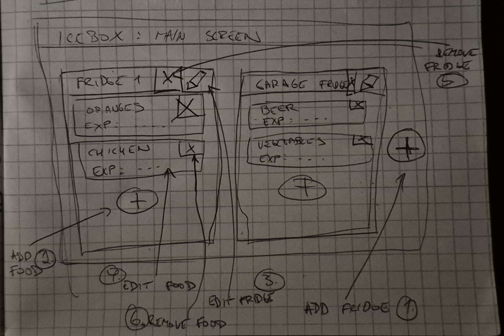
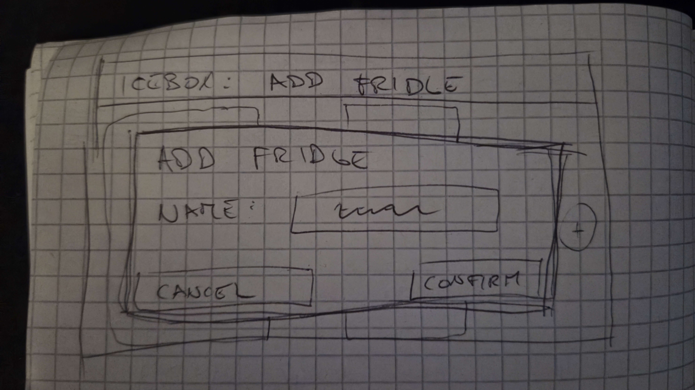
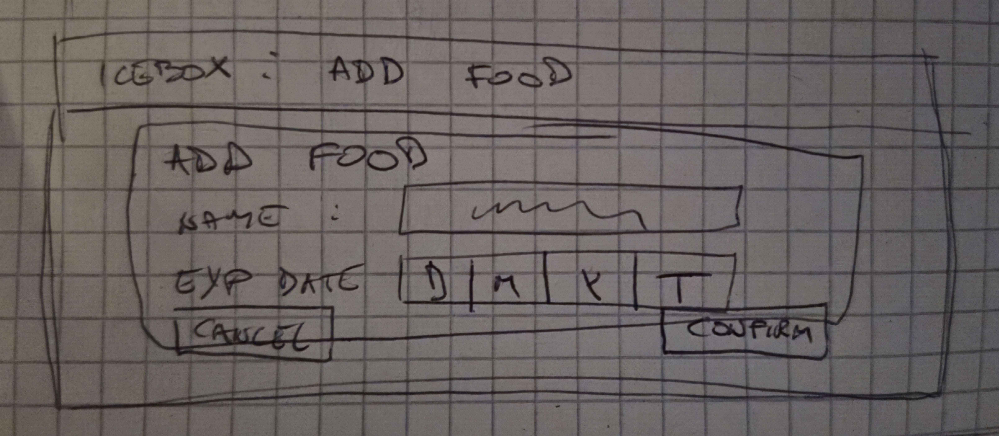
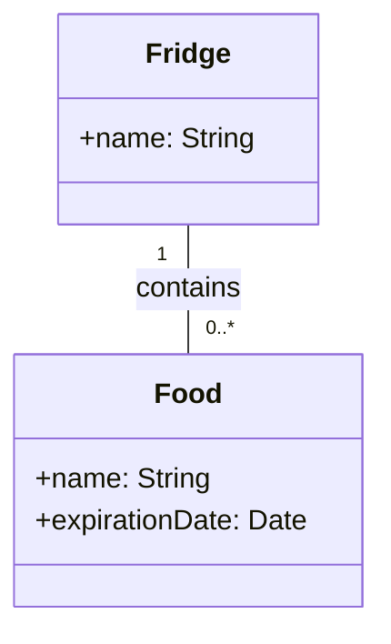
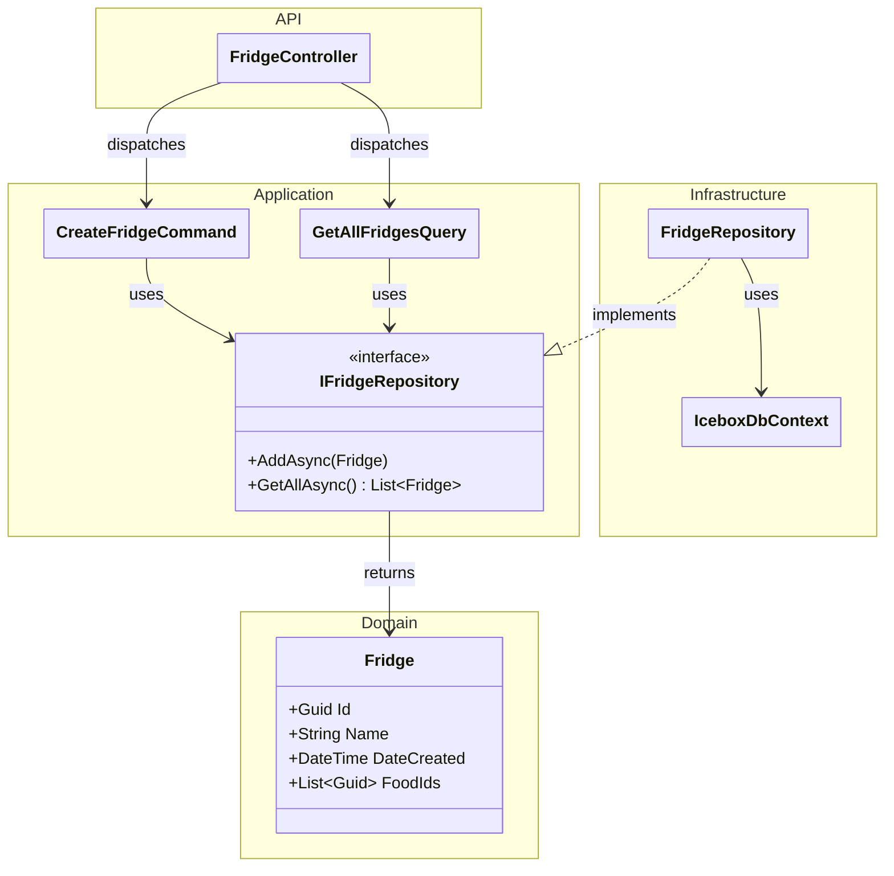

# Icebox
A smart fridge tracker focused on effortless food logging and timely expiration alerts so nothing goes to waste.

## Analysis

### Wireframes

### Use cases

1. Add fridge
2. Add food
3. Update fridge name
4. Update food name or expiration date
5. Remove fridge
6. Remove food

#### Add fridge

1. User clicks add fridge button on the main screen
2. System shows a prompt window where the user can input the new fridge name and confirm
3. User inputs the fridge name and confirms
4. System shows the main screen with the new fridge added and saves the new fridge into database

#### Add food

1. User clicks add food button inside some fridge
2. System shows a prompt window where the user can input the name of the food and expiration date
3. User inputs the food name and expiration date and confirms
4. System shows the main screen with new food added to the coresponding fridge and saves new food in the database

#### Update fridge name

1. User clicks edit fridge button on some fridge
2. System shows a prompt window where the user can edit the name of the fridge with the existing name pre-filled
3. User inputs the new name and confirms
4. System shows the main screen with the fridge name changed and saves changes into database

#### Update food name or expiration date

1. User clicks some food
2. System shows a prompt window where the user can edit the name of the food and its expiration date with the existing values pre-filled
3. User inputs new name or expiration date and confirms
4. System shows the main screen with the food values changed and saves changes into database

#### Remove fridge

1. User clicks the remove fridge button on some fridge
2. System shows the main screen with the fridge removed and removes the fridge and all its food from the database

#### Remove food

1. User clicks the remove food button on some food
2. System shows the main screen with the food removed and removes the food from the database

### Domain diagram

## Design

### Endpoint definition

- GET /fridge
    - Gets all fridges and their food ids
- GET /fridge/{id}
    - Gets fridge and its food ids
- GET /food/{id}
    - Gets food and its name and expiration date
- POST /fridge
    - Creates fridge with name
- POST /food
    - Creates food with name and expiration date
- PATCH /food/{id}
    - Updates food name or expiration date
- PATCH /fridge/{id}
    - Updates fridge name
- DELETE /fridge/{id}
    - Deletes a fridge and all its food
- DELETE /food/{id}
    - Deletes food

### BE class diagram

#### Fridges

### FE class diagram

## Implementation

### BE

### FE

## Testing

### BE

### FE

## Deployment

### Docker

### Github actions

### Git
