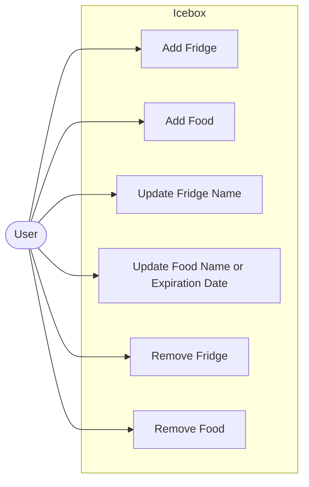
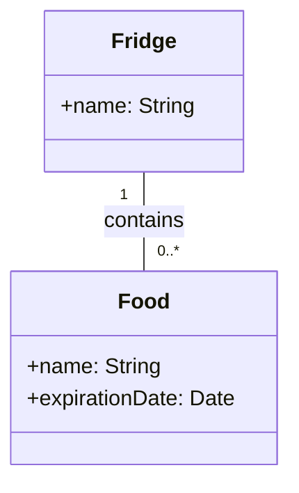
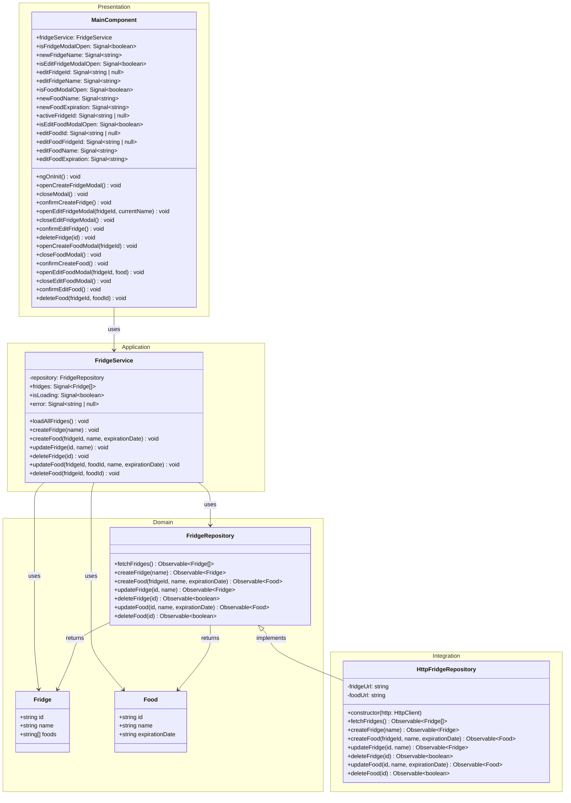

# Icebox

A smart fridge tracker focused on effortless food logging and timely expiration alerts so nothing goes to waste.

## Analysis

### Wireframes


### Use cases


```mermaid
graph LR
    User([User])
    subgraph Icebox
        UC1[Add Fridge]
        UC2[Add Food]
        UC3[Update Fridge Name]
        UC4[Update Food Name or Expiration Date]
        UC5[Remove Fridge]
        UC6[Remove Food]
    end
    User --> UC1
    User --> UC2
    User --> UC3
    User --> UC4
    User --> UC5
    User --> UC6
```

#### Add fridge

1. User clicks add fridge button on the main screen
2. System shows a prompt window where the user can input the new fridge name and confirm
3. User inputs the fridge name and confirms
4. System shows the main screen with the new fridge added and saves the new fridge into database

#### Add food

1. User clicks add food button inside some fridge
2. System shows a prompt window where the user can input the name of the food and expiration date
3. User inputs the food name and expiration date and confirms
4. System shows the main screen with new food added to the coresponding fridge and saves new food in the database

#### Update fridge name

1. User clicks edit fridge button on some fridge
2. System shows a prompt window where the user can edit the name of the fridge with the existing name pre-filled
3. User inputs the new name and confirms
4. System shows the main screen with the fridge name changed and saves changes into database

#### Update food name or expiration date

1. User clicks some food
2. System shows a prompt window where the user can edit the name of the food and its expiration date with the existing values pre-filled
3. User inputs new name or expiration date and confirms
4. System shows the main screen with the food values changed and saves changes into database

#### Remove fridge

1. User clicks the remove fridge button on some fridge
2. System shows the main screen with the fridge removed and removes the fridge and all its food from the database

#### Remove food

1. User clicks the remove food button on some food
2. System shows the main screen with the food removed and removes the food from the database

### Domain diagram


```mermaid
classDiagram
    class Fridge {
        +name: String
    }
    class Food {
        +name: String
        +expirationDate: Date
    }

    Fridge "1" -- "0..*" Food : contains
```

## Design

### Endpoint definition

- GET /fridge
  - Gets all fridges and their food ids
- GET /fridge/{id}
  - Gets fridge and its food ids
- GET /food/{id}
  - Gets food and its name and expiration date
- POST /fridge
  - Creates fridge with name
- POST /food
  - Creates food with name and expiration date
- PATCH /food/{id}
  - Updates food name or expiration date
- PATCH /fridge/{id}
  - Updates fridge name
- DELETE /fridge/{id}
  - Deletes a fridge and all its food
- DELETE /food/{id}
  - Deletes food

### BE class architecture

The backend is built with Clean Architecture and CQRS pattern via MediatR. Domain layer encapsulates rich, behavior-driven entities and defines the data access contracts. The Application layer orchestrates business use cases by defining Commands for state mutations and Queries for data retrieval, alongside their respective MediatR Handlers and Response DTOs. The Infrastructure layer implements these data contracts using Entity Framework Core with a dual approach: Commands rely on state-tracking Repositories to load, mutate, and persist domain entities, while Queries bypass repositories entirely to utilize dedicated Read Services. The API layer features thin Controllers whose responsibilities are mapping HTTP requests to MediatR messages, dispatching them, and returning the appropriate HTTP status codes, ensuring the web presentation remains decoupled from application logic.


```mermaid
%%{init: {'class': {'hideEmptyMembersBox': true}}}%%
classDiagram
    namespace Domain {
        class Fridge {
            +Guid Id
            +String Name
            +DateTime DateCreated
            -List~Food~ foods
            +IReadOnlyCollection~Food~ Foods
            +UpdateName(String)
        }
        class Food {
            +Guid Id
            +String Name
            +DateTime ExpirationDate
            +Guid FridgeId
            +UpdateDetails(String, DateTime)
        }
        class IFridgeRepository {
            <<interface>>
            +AddAsync(Fridge, CancellationToken) Task
            +GetByIdAsync(Guid, CancellationToken) Task~Fridge~
            +DeleteAsync(Fridge, CancellationToken) Task
            +SaveChangesAsync(CancellationToken) Task
        }
        class IFoodRepository {
            <<interface>>
            +AddAsync(Food, CancellationToken) Task
            +GetByIdAsync(Guid, CancellationToken) Task~Food~
            +GetAllAsync(CancellationToken) Task~List~Food~~
            +DeleteAsync(Food, CancellationToken) Task
            +SaveChangesAsync(CancellationToken) Task
        }
    }

    namespace Application {
        class FoodResponse {
            <<record>>
            +Guid Id
            +String Name
            +DateTime ExpirationDate
            +Guid FridgeId
        }
        class FridgeResponse {
            <<record>>
            +Guid Id
            +String Name
            +DateTime DateCreated
            +List~FoodResponse~ Foods
        }
        class IFridgeReadService {
            <<interface>>
            +GetAllFridgesWithFoodsAsync(CancellationToken) Task~List~FridgeResponse~~
        }

        %% Single Command Example
        class CreateFoodCommand {
            <<record>>
            +String Name
            +DateTime ExpirationDate
            +Guid FridgeId
        }
        class CreateFoodCommandHandler {
            +Handle(CreateFoodCommand, CancellationToken) Task~FoodResponse~
        }

        %% Single Query Example
        class GetAllFridgesQuery {
            <<record>>
        }
        class GetAllFridgesQueryHandler {
            +Handle(GetAllFridgesQuery, CancellationToken) Task~List~FridgeResponse~~
        }
    }

    namespace Infrastructure {
        class IceboxDbContext {
            <<class>>
        }
        class FoodRepository {
            -IceboxDbContext _context
            +AddAsync(Food, CancellationToken) Task
            +GetByIdAsync(Guid, CancellationToken) Task~Food~
            +DeleteAsync(Food, CancellationToken) Task
            +SaveChangesAsync(CancellationToken) Task
            +GetAllAsync(CancellationToken) Task~List~Food~~
        }
        class FridgeReadService {
            -IceboxDbContext _context
            +GetAllFridgesWithFoodsAsync(CancellationToken) Task~List~FridgeResponse~~
        }
        class FridgeRepository {
            -IceboxDbContext _context
            +AddAsync(Fridge, CancellationToken) Task
            +GetAllAsync(CancellationToken) Task~List~Fridge~~
            +GetByIdAsync(Guid, CancellationToken) Task~Fridge~
            +DeleteAsync(Fridge, CancellationToken) Task
            +SaveChangesAsync(CancellationToken) Task
        }
    }

    namespace API {
        class CreateFoodRequest {
            <<record>>
            +String Name
            +DateTime ExpirationDate
            +Guid FridgeId
        }

        class FoodController {
            -IMediator _mediator
            +Create(CreateFoodRequest, CancellationToken) Task~IActionResult~
        }

        class FridgeController {
            -IMediator _mediator
            +GetAll(CancellationToken) Task~IActionResult~
        }
    }

    %% Domain Relationships
    Fridge *-- Food : contains

    %% Application Relationships
    FridgeResponse *-- FoodResponse : contains

    %% Command Pattern
    CreateFoodCommandHandler ..> CreateFoodCommand : handles
    CreateFoodCommandHandler ..> IFoodRepository : uses
    CreateFoodCommandHandler ..> IFridgeRepository : uses

    %% Query Pattern
    GetAllFridgesQueryHandler ..> GetAllFridgesQuery : handles
    GetAllFridgesQueryHandler ..> IFridgeReadService : uses

    %% Infrastructure Implementations
    FoodRepository ..|> IFoodRepository : implements
    FridgeRepository ..|> IFridgeRepository : implements
    FridgeReadService ..|> IFridgeReadService : implements

    FoodRepository ..> IceboxDbContext : depends on
    FridgeRepository ..> IceboxDbContext : depends on
    FridgeReadService ..> IceboxDbContext : depends on

    %% API Dependencies
    FoodController ..> CreateFoodRequest : uses
    FoodController ..> CreateFoodCommand : sends
    FridgeController ..> GetAllFridgesQuery : sends
```

### FE class architecture

On the frontend ive tried to implement the clean architecture aswel. Initial idea was to have the classic linear data flow of Controller -> Use Case -> Repos / Services / Presenters -> View where view would be the Component. But since i cant controll the lifecycle of Components i cant inject them into a Controller and all input actions come from the Component so i would have to listen to input events in my Controller somehow. That was too complicated and my plan failed. So ive implemented a simplified approach so far. Component is the entry point. Inside the Component methods I call methods of a "Service". These methods are what i consider the Use Cases. These Use Cases (Service methods) orchestrate the app. They call services modify the needed in memory state and so on. The component then keeps a reference to the state which lives inside of this service and updates the UI with Signals.


```mermaid
%%{init: {'class': {'hideEmptyMembersBox': true}}}%%
classDiagram
    namespace Domain {
        class Fridge {
            +string id
            +string name
            +string[] foods
        }
        class Food {
            +string id
            +string name
            +string expirationDate
        }
        class FridgeRepository {
            +fetchFridges() Observable~Fridge[]~
            +createFridge(name) Observable~Fridge~
            +createFood(fridgeId, name, expirationDate) Observable~Food~
            +updateFridge(id, name) Observable~Fridge~
            +deleteFridge(id) Observable~boolean~
            +updateFood(id, name, expirationDate) Observable~Food~
            +deleteFood(id) Observable~boolean~
        }
    }
    namespace Application {
        class FridgeService {
            -repository: FridgeRepository
            +fridges: Signal~Fridge[]~
            +isLoading: Signal~boolean~
            +error: Signal~string | null~
            +loadAllFridges() void
            +createFridge(name) void
            +createFood(fridgeId, name, expirationDate) void
            +updateFridge(id, name) void
            +deleteFridge(id) void
            +updateFood(fridgeId, foodId, name, expirationDate) void
            +deleteFood(fridgeId, foodId) void
        }
    }
    namespace Presentation {
        class MainComponent {
            +fridgeService: FridgeService
            +isFridgeModalOpen: Signal~boolean~
            +newFridgeName: Signal~string~
            +isEditFridgeModalOpen: Signal~boolean~
            +editFridgeId: Signal~string | null~
            +editFridgeName: Signal~string~
            +isFoodModalOpen: Signal~boolean~
            +newFoodName: Signal~string~
            +newFoodExpiration: Signal~string~
            +activeFridgeId: Signal~string | null~
            +isEditFoodModalOpen: Signal~boolean~
            +editFoodId: Signal~string | null~
            +editFoodFridgeId: Signal~string | null~
            +editFoodName: Signal~string~
            +editFoodExpiration: Signal~string~
            +ngOnInit() void
            +openCreateFridgeModal() void
            +closeModal() void
            +confirmCreateFridge() void
            +openEditFridgeModal(fridgeId, currentName) void
            +closeEditFridgeModal() void
            +confirmEditFridge() void
            +deleteFridge(id) void
            +openCreateFoodModal(fridgeId) void
            +closeFoodModal() void
            +confirmCreateFood() void
            +openEditFoodModal(fridgeId, food) void
            +closeEditFoodModal() void
            +confirmEditFood() void
            +deleteFood(fridgeId, foodId) void
        }
    }

    namespace Integration {
        class HttpFridgeRepository {
            -fridgeUrl: string
            -foodUrl: string
            +constructor(http: HttpClient)
            +fetchFridges() Observable~Fridge[]~
            +createFridge(name) Observable~Fridge~
            +createFood(fridgeId, name, expirationDate) Observable~Food~
            +updateFridge(id, name) Observable~Fridge~
            +deleteFridge(id) Observable~boolean~
            +updateFood(id, name, expirationDate) Observable~Food~
            +deleteFood(id) Observable~boolean~
        }
    }

    MainComponent --> FridgeService : uses
    FridgeService --> FridgeRepository : uses
    FridgeRepository <|-- HttpFridgeRepository : implements
    FridgeService --> Fridge : uses
    FridgeService --> Food : uses
    FridgeRepository --> Fridge : returns
    FridgeRepository --> Food : returns
```

## Implementation

### BE

I created one solution with a project for Domain, Application, Integration and API. I added the CQRS library and created the Commands and queries for the planned use cases. For db access i used EF core.

#### API conventions

Ive thought a bit about how do i want to design my api:

use plural nouns and small letters
POST /fridges

for potential nested enpoints like POST /fridges/foods I rather use POST /foods with the fridge id in body.

i try to match the FE needs so for example there is the GET /fridges endpoint that gets all fridges and all their food details.

### FE

Frontend is just one bloated component with one service. No special libraries were used.

## Testing

- Unit tests are implemented using **xUnit** for the Domain layer, covering core entity invariants and business logic validations such as `Fridge` naming rules.
- Run the backend test suite via the command line:
  ```bash
  dotnet test src/backend/Icebox.Domain.Tests/Icebox.Domain.Tests.csproj
  ```

### FE

- Frontend component and service tests are configured with Vitest and Angular Testing Library.
- Run the frontend tests using the Angular CLI or package manager script:

```bash
npm --prefix src/frontend test
```

## Deployment

### Docker

The application is fully containerized using a multi-service docker-compose setup combining PostgreSQL, the .NET 10 API, and the Angular frontend.

To build and spin up the entire stack locally, run the following command from the root directory:

```bash
docker compose up --build
```

Services will be exposed at:

Frontend (Web): http://localhost:4200

Backend API: http://localhost:8080 (includes Scalar API documentation at root in development)

Database: http://localhost:5432

### Github actions

Automated CI workflows are set up via GitHub Actions to automatically restore, build, and run both the .NET backend and Angular test suites on pushes and pull requests to main and develop.

### Git

Repository is initialized with a standard .NET and Node/Angular .gitignore configuration covering build outputs, user-specific IDE settings (.vs/, .idea/), and dependency directories (node_modules/, bin/, obj/).

Branching Strategy: Uses a structured workflow where main contains stable iteration releases, develop acts as the integration branch for ongoing development, and feature branches are created off develop using the naming convention iteration-{iterationnumber}/feature-name before being merged back into dev.
